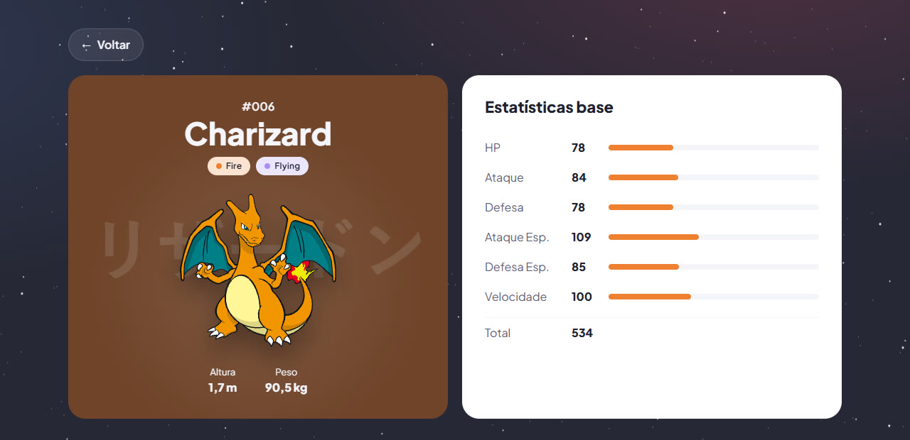

<div align="center">
  

  # Pokédex

  Browse every Pokémon — all 1025 of the National Pokédex — with types and base stats.<br>
  Built with Angular and powered by the public [PokéAPI](https://pokeapi.co/). The UI is in Portuguese (pt-BR).

  **[Open the live app →](https://djbrunoramon.github.io/pokedex/)**
</div>

<p align="center">
  
  
</p>

## Features

- **Every Pokémon, with infinite scroll** — the full species index loads in one request; cards are rendered 24 at a time as you scroll, and each card fetches its own details (with a placeholder while it loads).
- **Search across the whole Pokédex** — by name (`chu` finds Pikachu, Raichu, Pichu…) or by number (`25`, `#150`), including Pokémon that aren't on screen yet.
- **Shareable searches** — the search lives in the URL (`?q=char`), so it survives going to a details page and back, a refresh, or a shared link.
- **Details page** — Pokédex number, types, height and weight, and base stats with proportional bars and their total.
- **Loading, empty and error states** everywhere, with a *retry* when the API is unreachable.
- **Polished, accessible UI** — cards and pages coloured by type, an animated starry sky, keyboard focus styles, screen-reader labels and announcements, and `prefers-reduced-motion` support.
- **Lean networking** — details are cached per Pokémon, requests nobody waits for are cancelled, and the search is debounced.

## Tech stack

- [Angular](https://angular.dev/) 22 — standalone components, signals (`computed`, `linkedSignal`, `rxResource`), zoneless change detection
- [RxJS](https://rxjs.dev/) for the HTTP layer
- TypeScript 6 in strict mode, with typed PokéAPI responses
- SCSS with design tokens (CSS custom properties)
- [Vitest](https://vitest.dev/) for unit tests

## Requirements

- Node.js 20.19+, 22.12+ or 24+
- npm

## Getting started

```bash
npm install
npm start
```

Then open `http://localhost:4200/`. The app reloads automatically when you change a source file (the dev server polls for changes, so this also works on Windows drives mounted in WSL).

## Scripts

| Command                | Description                                                         |
| ---------------------- | ------------------------------------------------------------------- |
| `npm start`            | Start the dev server at `http://localhost:4200/`                    |
| `npm run build`        | Production build to `dist/pokedex/browser/`                         |
| `npm run watch`        | Incremental development build                                       |
| `npm test`             | Run the unit tests with Vitest                                      |
| `npm run build-github` | Production build into `docs/` for GitHub Pages (see [Deployment](#deployment)) |

## Project structure

```
src/
├── app/
│   ├── models/          # Typed PokéAPI responses
│   ├── service/         # PokeApiService — the only API layer (index, cached details)
│   ├── pages/
│   │   ├── home/        # Hero + Pokémon list
│   │   └── details/     # Pokémon details and stats
│   ├── shared/
│   │   ├── poke-list/   # Search, paging/infinite scroll, loading/empty/error states
│   │   ├── poke-card/   # A card that loads its own Pokémon
│   │   ├── poke-search/ # Debounced search box
│   │   ├── poke-footer/ # Credits
│   │   ├── directives/  # InViewportDirective (infinite scroll trigger)
│   │   └── pipes/       # DexNumberPipe (#001), SpritePipe (artwork fallback)
│   ├── app.config.ts
│   └── app.routes.ts
├── assets/              # Icons, illustrations
├── config-scss/         # Global SCSS: tokens, reset, type colours, starfield, animations…
└── styles.scss
scripts/github-pages.mjs # Post-build step for the GitHub Pages deploy
docs/                    # Built site served by GitHub Pages
```

## Testing

```bash
npm test
```

Specs live next to their subject (`*.spec.ts`) and cover the API service (caching, cancellation), the list (paging, search, URL sync, states), cards, details, search box, the infinite-scroll directive and the pipes. To run a single file or test:

```bash
npx ng test --include='**/poke-list.component.spec.ts'
npx ng test --filter='searches the whole index'
```

## Deployment

The app is published to GitHub Pages from the `docs/` folder on `main`. To deploy:

```bash
npm run build-github   # production build into docs/ with base href /pokedex/
git add docs && git commit -m "chore: deploy to GitHub Pages" && git push
```

The script also copies `index.html` to `404.html`, so deep links such as `/pokedex/details/25` (which GitHub Pages answers with `404.html`) still boot the app, and adds `.nojekyll`.

## Credits

Pokémon data and artwork come from [PokéAPI](https://pokeapi.co/). Pokémon and Pokémon names are trademarks of Nintendo, Game Freak and The Pokémon Company; this is a non-commercial fan project.

Developed by [Bruno Ramon](https://github.com/djbrunoramon).
